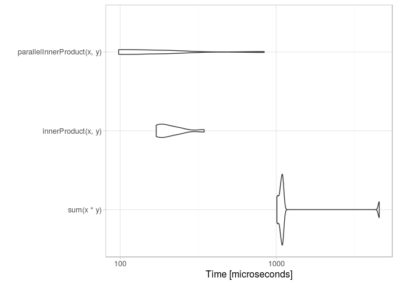

# RcppParallel Examples
Andrey Ziyatdinov  
`r Sys.Date()`  


# Include


```r
library(Rcpp)
library(RcppParallel)
library(RcppArmadillo)

library(microbenchmark)
```

# Inner Product

The code is copied from [gallery.rcpp.org/articles/parallel-inner-product/](http://gallery.rcpp.org/articles/parallel-inner-product/).

## Serial version


```r
sourceCpp(code = '
  #include <Rcpp.h>
  using namespace Rcpp;

  #include <algorithm>

  // [[Rcpp::export]]
  double innerProduct(NumericVector x, NumericVector y) {
     return std::inner_product(x.begin(), x.end(), y.begin(), 0.0);
  }'
)
```

## Parallel version


```r
sourceCpp(code = '
  #include <Rcpp.h>
  #include <RcppParallel.h>

  // [[Rcpp::depends(RcppParallel)]]
  using namespace RcppParallel;
  using namespace Rcpp;
  
  using namespace RcppParallel;

  struct InnerProduct : public Worker
  {   
     // source vectors
     const RVector<double> x;
     const RVector<double> y;
   
     // product that I have accumulated
     double product;
   
     // constructors
     InnerProduct(const NumericVector x, const NumericVector y) 
        : x(x), y(y), product(0) {}
     InnerProduct(const InnerProduct& innerProduct, Split) 
        : x(innerProduct.x), y(innerProduct.y), product(0) {}
   
     // process just the elements of the range Ive been asked to
     void operator()(std::size_t begin, std::size_t end) {
        product += std::inner_product(x.begin() + begin, 
                                    x.begin() + end, 
                                    y.begin() + begin, 
                                    0.0);
     }
   
     // join my value with that of another InnerProduct
     void join(const InnerProduct& rhs) { 
       product += rhs.product; 
     }
   };
   
  // [[Rcpp::export]]
  double parallelInnerProduct(NumericVector x, NumericVector y) 
  {
    // declare the InnerProduct instance that takes a pointer to the vector data
    InnerProduct innerProduct(x, y);
   
    // call paralleReduce to start the work
    parallelReduce(0, x.length(), innerProduct);
   
    // return the computed product
    return innerProduct.product;
  }'
)
```


```r
x <- runif(1e5)
y <- runif(1e5)

out <- microbenchmark(
  sum(x*y),
  innerProduct(x, y),
  parallelInnerProduct(x, y),
  times = 10)

autoplot(out)  
```

 

