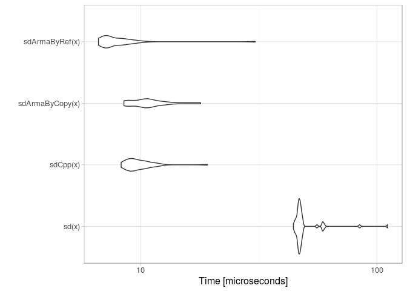
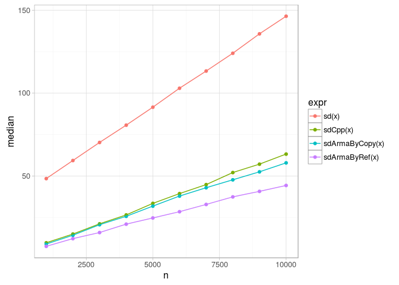
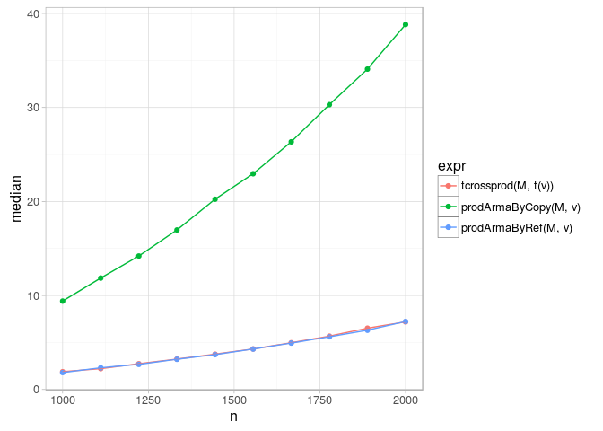

# Rcpp: pass arguments by reference
Andrey Ziyatdinov  
`r Sys.Date()`  


# About

## Problem statement

Armadillo library contains many functions that perform efficiently.
When integrating Armadillo and R via RcppArmadillo,
one can make a  mistake in how you instantiate the Armadillo object.
That in turn leads to copies and hence degraded performance.

The solution is to use an interface `const arma::vec & invec`.

See [this](http://stackoverflow.com/questions/24253228/performance-of-r-statssd-vs-armastddev-vs-rcpp-implementation) 
question for more details.

## Experiments

Here we will present both correct and missleading implementation for two operations:

* computing standard deviation in a vector of data points;
* compute matrix by vector product.

# Include


```r
library(Rcpp)

library(microbenchmark)
```

# Computing SD

Code is copied from the original [post](http://stackoverflow.com/questions/24253228/performance-of-r-statssd-vs-armastddev-vs-rcpp-implementation).


```r
sourceCpp(code = '
#include <RcppArmadillo.h>
// [[Rcpp::depends(RcppArmadillo)]]  

#include <vector>
#include <cmath>
#include <numeric>

// [[Rcpp::export]]
double sdCpp(Rcpp::NumericVector rinVec) 
{
  std::vector<double> inVec(rinVec.begin(), rinVec.end());
  
  int n = inVec.size();
  double sum = std::accumulate(inVec.begin(), inVec.end(), 0.0);
  double mean = sum / inVec.size();

  for(std::vector<double>::iterator iter = inVec.begin();
      iter != inVec.end(); 
      ++iter){
    double temp = (*iter - mean)*(*iter - mean);
    *iter = temp;
  }

  double sd = std::accumulate(inVec.begin(), inVec.end(), 0.0);
  return std::sqrt( sd / (n-1) );
}

// [[Rcpp::export]]      
double sdArmaByCopy(arma::colvec inVec) 
{
  return arma::stddev(inVec);
}

//  [[Rcpp::export]]    
double sdArmaByRef(const arma::colvec & inVec) 
{ 
  return arma::stddev(inVec); 
}
')
```

## Check all function computes the same


```r
x <- 1:10
all(c(sdCpp(x), sdArmaByCopy(x), sdArmaByRef(x)) == sd(x))
```

```
[1] TRUE
```

## Benchmakrs


```r
x <- rexp(1000)

out <- microbenchmark(sd(x), sdCpp(x), sdArmaByCopy(x), sdArmaByRef(x),
  times = 50)
  
autoplot(out)
```

 

## Benchmakrs


```r
nseq <- seq(1000, 10000, length = 10)
df <- ldply(nseq, function(n) {
  x <- rexp(n)

  out <- microbenchmark(sd(x), sdCpp(x), sdArmaByCopy(x), sdArmaByRef(x),
    times = 10)
  
  df <- subset(as.data.frame(summary(out)), select = c("expr", "median"))
  df$n <- n
  
  return(df)
})  
```


```r
ggplot(df, aes(n, median, color = expr)) + geom_point() + geom_line()
```

 

# Matrix by vector


```r
sourceCpp(code = '
#include <RcppArmadillo.h>
// [[Rcpp::depends(RcppArmadillo)]]  

using namespace arma;

#include <vector>
#include <cmath>
#include <numeric>

// [[Rcpp::export]]      
arma::vec prodArmaByCopy(arma::mat mat, arma::vec vec) 
{
  arma::vec rvec = mat * vec;
  return rvec;
}
 
// [[Rcpp::export]]      
arma::vec prodArmaByRef(const arma::mat & mat, const arma::vec & vec) 
{
  arma::vec rvec = mat * vec;
  return rvec;
} 
')
```

## Benchmakrs


```r
nseq <- seq(1000, 2000, length = 10)
df <- ldply(nseq, function(n) {
  v <- rexp(n)
  M <- matrix(rexp(n*n), nrow = n, ncol = n)
  
  out <- microbenchmark(tcrossprod(M, t(v)), 
    prodArmaByCopy(M, v),
    prodArmaByRef(M, v),
    times = 10)
  
  df <- subset(as.data.frame(summary(out)), select = c("expr", "median"))
  df$n <- n
  
  return(df)
})  
```


```r
ggplot(df, aes(n, median, color = expr)) + geom_point() + geom_line()
```

 

