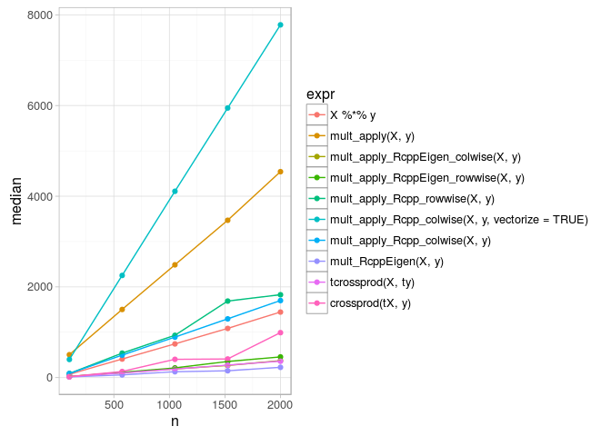
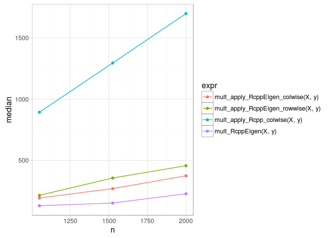
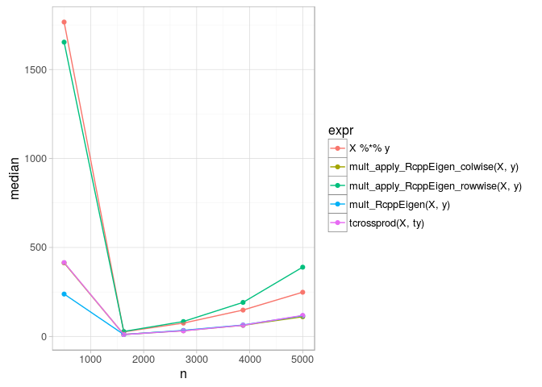
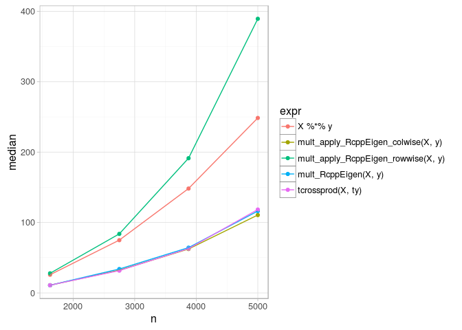
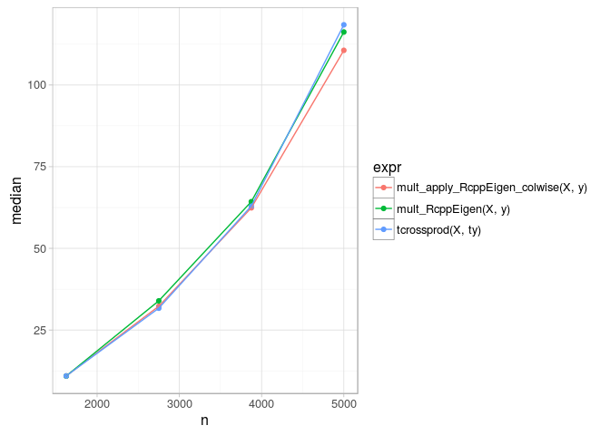

# RcppEigen use cases
Andrey Ziyatdinov  
`r Sys.Date()`  


# Include


```r
library(microbenchmark)

library(Rcpp)
```
# Column-wise storage


```r
n <- 1000
k <- 10

set.seed(1)
X <- matrix(runif(n * k), nrow = n, ncol = k)
y <- runif(k)

tX <- t(X)
ty <- t(y)
```

## Multiplication using `%*%`


```r
str(X %*% y)
```

```
 num [1:1000, 1] 2.53 2.46 2.79 2.16 2.05 ...
```

```r
str(ty %*% tX)
```

```
 num [1, 1:1000] 2.53 2.46 2.79 2.16 2.05 ...
```

## Multiplication using apply


```r
mult_apply <- function(X, y) {
  prod <- rep(0, nrow(X)) 
  
  for(i in 1:ncol(X)) {
    prod <- prod + X[, i] * y[i]
  }
  
  return(prod)
}

str(mult_apply(X, y))
```

```
 num [1:1000] 2.53 2.46 2.79 2.16 2.05 ...
```

## Multiplication using `crossprod`


```r
str(tcrossprod(X, ty))
```

```
 num [1:1000, 1] 2.53 2.46 2.79 2.16 2.05 ...
```

```r
str(tcrossprod(ty, X))
```

```
 num [1, 1:1000] 2.53 2.46 2.79 2.16 2.05 ...
```


```r
str(crossprod(tX, y))
```

```
 num [1:1000, 1] 2.53 2.46 2.79 2.16 2.05 ...
```

## Multiplication using `mult_RcppEigen`


```r
sourceCpp("src/mult_RcppEigen.cpp")
```


```r
str(mult_RcppEigen(X, y))
```

```
 num [1:1000] 2.53 2.46 2.79 2.16 2.05 ...
```

## Multiplication using `mult_apply_RcppEigen_colwise`


```r
sourceCpp("src/mult_apply_RcppEigen_colwise.cpp") 
```


```r
str(mult_apply_RcppEigen_colwise(X, y))
```

```
 num [1:1000] 2.53 2.46 2.79 2.16 2.05 ...
```

## Multiplication using `mult_apply_RcppEigen_rowwise`


```r
sourceCpp("src/mult_apply_RcppEigen_rowwise.cpp") 
```


```r
str(mult_apply_RcppEigen_rowwise(X, y))
```

```
 num [1:1000] 2.53 2.46 2.79 2.16 2.05 ...
```

## Multiplication using `mult_apply_Rcpp_rowwise`


```r
sourceCpp("src/mult_apply_Rcpp_rowwise.cpp") 
```


```r
str(mult_apply_Rcpp_rowwise(X, y))
```

```
 num [1:1000] 2.53 2.46 2.79 2.16 2.05 ...
```

## Multiplication using `mult_apply_Rcpp_rowwise`


```r
sourceCpp("src/mult_apply_Rcpp_colwise.cpp") 
```


```r
str(mult_apply_Rcpp_colwise(X, y))
```

```
 num [1:1000] 2.53 2.46 2.79 2.16 2.05 ...
```

## Benchmarks (k << n)


```r
nseq <- seq(100, 2000, length = 5)
df <- ldply(nseq, function(n) {
  n <- ceiling(n)
  k <- 100

  set.seed(1)
  X <- matrix(runif(n * k), nrow = n, ncol = k)
  y <- runif(k)

  tX <- t(X)
  ty <- t(y)
  
  cat(" * n:", n, "\n")
  
  out <- microbenchmark(
    X %*% y,
    mult_apply(X, y),
    mult_apply_RcppEigen_colwise(X, y),
    mult_apply_RcppEigen_rowwise(X, y),
    mult_apply_Rcpp_rowwise(X, y), 
    mult_apply_Rcpp_colwise(X, y, vectorize = TRUE),
    mult_apply_Rcpp_colwise(X, y),       
    mult_RcppEigen(X, y),
    tcrossprod(X, ty), 
    crossprod(tX, y),
    times = 10)
  
  df <- subset(as.data.frame(summary(out)), select = c("expr", "median"))
  df$n <- n
  
  return(df)
})  
```

```
 * n: 100 
 * n: 575 
 * n: 1050 
 * n: 1525 
 * n: 2000 
```


```r
ggplot(df, aes(n, median, color = expr)) + geom_point() + geom_line()
```

 


```r
ggplot(subset(df, n > 1000 & (expr %in% c("mult_apply_RcppEigen_colwise(X, y)",
  "mult_apply_RcppEigen_rowwise(X, y)", "mult_apply_Rcpp_rowwise(X, y)",
  "mult_apply_Rcpp_colwise(X, y, vectorize = TRUE)",
  "mult_apply_Rcpp_colwise(X, y)", "mult_RcppEigen(X, y)"))), 
  aes(n, median, color = expr)) + geom_point() + geom_line()
```

 


```r
ggplot(subset(df, n > 1000 & (expr %in% 
  c("mult_apply_RcppEigen_colwise(X, y)", "mult_apply_Rcpp_colwise(X, y)",
    "mult_apply_RcppEigen_rowwise(X, y)",
    "mult_RcppEigen(X, y)"))), 
  aes(n, median, color = expr)) + geom_point() + geom_line()
```

 


## Benchmarks (k == n)


```r
nseq <- seq(500, 5000, length = 5)
df <- ldply(nseq, function(n) {
  n <- ceiling(n)
  k <- n

  set.seed(1)
  X <- matrix(runif(n * k), nrow = n, ncol = k)
  y <- runif(k)

  tX <- t(X)
  ty <- t(y)
  
  cat(" * n:", n, "\n")
  
  out <- microbenchmark(
    X %*% y,
    mult_apply_RcppEigen_colwise(X, y),
    mult_apply_RcppEigen_rowwise(X, y),
    mult_RcppEigen(X, y),
    tcrossprod(X, ty), 
    times = 10)
  
  df <- subset(as.data.frame(summary(out)), select = c("expr", "median"))
  df$n <- n
  
  return(df)
})  
```

```
 * n: 500 
 * n: 1625 
 * n: 2750 
 * n: 3875 
 * n: 5000 
```


```r
ggplot(df, aes(n, median, color = expr)) + geom_point() + geom_line()
```

 


```r
ggplot(subset(df, n > 1000), aes(n, median, color = expr)) + geom_point() + geom_line()
```

 


```r
ggplot(subset(df, n > 1000 & !(expr %in% c("X %*% y", "mult_apply_RcppEigen_rowwise(X, y)"))), 
  aes(n, median, color = expr)) + geom_point() + geom_line()
```

 
