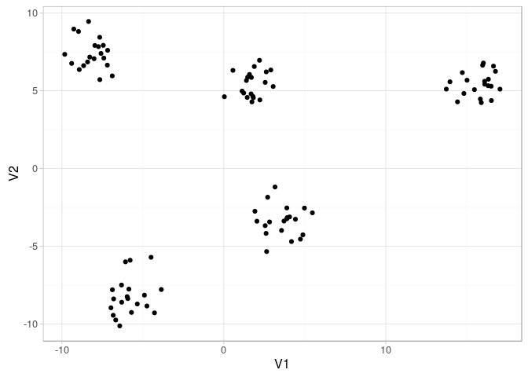
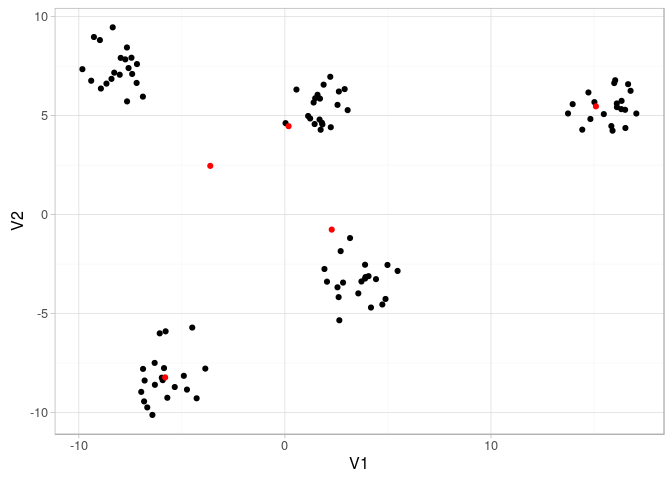

# Tutorial on rmr2
Andrey Ziyatdinov  
`r Sys.Date()`  


# About

References

* Example 1 Squares of integers & Example 2 Groups: [basic-examples.R](https://github.com/RevolutionAnalytics/rmr2/blob/master/pkg/tests/basic-examples.R)
* Example 2 Words Count: [wordcount.R](https://github.com/RevolutionAnalytics/rmr2/blob/master/pkg/tests/wordcount.R)
* Example 3 OLS
    * [linear-least-squares.R](https://github.com/RevolutionAnalytics/rmr2/blob/master/pkg/tests/linear-least-squares.R)
    * The same code with more details at [144.pdf](http://cks.univnt.ro/uploads/cks_2015_articles/index.php?dir=12_IT_in_social_sciences%2F&download=CKS+2015_IT_in_social_sciences_art.144.pdf)
* Example 4 K-means clustering
    * R code [kmeans.R](https://github.com/RevolutionAnalytics/rmr2/blob/master/pkg/tests/kmeans.R)


# Preparation

Set up Hadoop environment variables:


```r
Sys.setenv("HADOOP_CMD" = "/home/hduser/hadoop/bin/hadoop")
Sys.setenv("HADOOP_STREAMING" = "/home/hduser/hadoop/share/hadoop/tools/lib/hadoop-streaming-2.7.2.jar")
```

Include the R-Hadoop libraries:


```r
library(rhdfs)
library(rhbase)
library(rmr2)
```

# Map-reduce Examples

## Map-reduce Example 1: Squares of integers


```r
small.ints <- to.dfs(1:1000)

ret1 <- mapreduce(
  input = small.ints, 
  map = function(k, v) cbind(v, v^2))

out1 <- from.dfs(ret1)
```

Plot results:


```r
df <- as.data.frame(out1$val)
names(df) <- c("v", "v2")

ggplot(df, aes(v, v2)) + geom_point()
```

 

## Map-reduce Example 2: Groups

Data in R:


```r
set.seed(1)
groups <- rbinom(32, n = 50, prob = 0.4)
```

R code with `tapply` equivalent to map-reduce operation:


```r
tapply(groups, groups, length)
```

```
 7  9 10 11 12 13 14 15 16 17 20 
 2  2  4  4  7  8 10  7  2  3  1 
```

Send data to HDFS:

### Reduce is skipped


```r
groups_dfs <- to.dfs(groups)
```


```r
ret2_1 <- mapreduce(
  input = groups_dfs, 
  map = function(k, v) keyval(v, 1))

out2_1 <- from.dfs(ret2_1)
```

Table of results (first 5 rows):


|  key  |  val  |
|:-----:|:-----:|
|  11   |   1   |
|  11   |   1   |
|  11   |   1   |
|  11   |   1   |
|  12   |   1   |

### Reduce is on


```r
ret2_2 <- mapreduce(
  input = groups_dfs, 
  map = function(k, v) keyval(v, 1), 
  reduce = function(k, vv) keyval(k, length(vv)))

out2_2 <- from.dfs(ret2_2)
```

Table of results:


|  key  |  val  |
|:-----:|:-----:|
|   7   |   2   |
|   9   |   2   |
|  10   |   4   |
|  11   |   4   |
|  12   |   7   |
|  13   |   8   |
|  14   |  10   |
|  15   |   7   |
|  16   |   2   |
|  17   |   3   |
|  20   |   1   |

## Map-reduce Example 3: Word counter

Word-count functions:


```r
wc_map <- function(k, lines, pattern = " ") 
{
  keyval(
    unlist(strsplit(lines, pattern)), 
    1)
}

wc_reduce <- function(word, counts) 
{
  keyval(
    word, 
    sum(counts))
}
```


```r
text <- capture.output(license())
text_dfs <- to.dfs(text)
```


```r
text
```

```
 [1] ""                                                                    
 [2] "This software is distributed under the terms of the GNU General"     
 [3] "Public License, either Version 2, June 1991 or Version 3, June 2007."
 [4] "The terms of version 2 of the license are in a file called COPYING"  
 [5] "which you should have received with"                                 
 [6] "this software and which can be displayed by RShowDoc(\"COPYING\")."  
 [7] "Version 3 of the license can be displayed by RShowDoc(\"GPL-3\")."   
 [8] ""                                                                    
 [9] "Copies of both versions 2 and 3 of the license can be found"         
[10] "at https://www.R-project.org/Licenses/."                             
[11] ""                                                                    
[12] "A small number of files (the API header files listed in"             
[13] "R_DOC_DIR/COPYRIGHTS) are distributed under the"                     
[14] "LESSER GNU GENERAL PUBLIC LICENSE, version 2.1 or later."            
[15] "This can be displayed by RShowDoc(\"LGPL-2.1\"),"                    
[16] "or obtained at the URI given."                                       
[17] "Version 3 of the license can be displayed by RShowDoc(\"LGPL-3\")."  
[18] ""                                                                    
[19] "'Share and Enjoy.'"                                                  
[20] ""                                                                    
```


```r
ret3 <- mapreduce(
  input = text_dfs, 
  map = wc_map, reduce = wc_reduce, combine = TRUE)
  
out3 <- from.dfs(ret3)  
```

Top 5 words:


|  key  |  val  |
|:-----:|:-----:|
|  of   |   8   |
|  the  |   8   |
|  be   |   5   |
|  can  |   5   |
|  by   |   4   |

## Map-reduce Example 4: OLS solution for linear model

### Learn `Reduce` function

The `+` operator doesn't work for more than 2 matrices.


```r
ret <- try(do.call("+", llply(1:3, function(i) matrix(i, 2, 2))))
cat(ret)
```

```
Error in `+`(structure(c(1L, 1L, 1L, 1L), .Dim = c(2L, 2L)), structure(c(2L,  : 
  operator needs one or two arguments
```


```r
# See `?Reduce` for more info.
add <- function(x) Reduce("+", x)

# input list of matrices
llply(1:2, function(i) matrix(i, 2, 2))
```

```
[[1]]
     [,1] [,2]
[1,]    1    1
[2,]    1    1

[[2]]
     [,1] [,2]
[1,]    2    2
[2,]    2    2
```

```r
# pass it to `add` function
add(llply(1:2, function(i) matrix(i, 2, 2)))
```

```
     [,1] [,2]
[1,]    3    3
[2,]    3    3
```

### Learn parallel computation of t(X) * X


```r
# 10 observations, 4 variables
X <- matrix(1:10, 10, 4)
X
```

```
      [,1] [,2] [,3] [,4]
 [1,]    1    1    1    1
 [2,]    2    2    2    2
 [3,]    3    3    3    3
 [4,]    4    4    4    4
 [5,]    5    5    5    5
 [6,]    6    6    6    6
 [7,]    7    7    7    7
 [8,]    8    8    8    8
 [9,]    9    9    9    9
[10,]   10   10   10   10
```

```r
# split `X` matrix into batches by rows
X1 <- X[1:4, ]
X2 <- X[5:10, ]

# see results of computation per batch
list(t(X1) %*% X1, t(X2) %*% X2)
```

```
[[1]]
     [,1] [,2] [,3] [,4]
[1,]   30   30   30   30
[2,]   30   30   30   30
[3,]   30   30   30   30
[4,]   30   30   30   30

[[2]]
     [,1] [,2] [,3] [,4]
[1,]  355  355  355  355
[2,]  355  355  355  355
[3,]  355  355  355  355
[4,]  355  355  355  355
```

```r
# sum up the results per batch
add(list(t(X1) %*% X1, t(X2) %*% X2))
```

```
     [,1] [,2] [,3] [,4]
[1,]  385  385  385  385
[2,]  385  385  385  385
[3,]  385  385  385  385
[4,]  385  385  385  385
```

```r
# compare with `unparallel` code
t(X) %*% X
```

```
     [,1] [,2] [,3] [,4]
[1,]  385  385  385  385
[2,]  385  385  385  385
[3,]  385  385  385  385
[4,]  385  385  385  385
```

### Simulate data


```r
nr <- 2e5
nc <- 10
set.seed(1)
X <- matrix(rnorm(nr * nc), ncol = nc)

X_dfs <- to.dfs(cbind(1:nrow(X), X))
y <- as.matrix(rnorm(nr))
```

### Reducer is missing


```r
ret5_1 <- mapreduce(
  input = X_dfs, 
  map = function(., Xi) {
    list(dim(Xi))
  }) 
 
out5_1 <- from.dfs(ret5_1)
```
       

```r
str(out5_1)
```

```
List of 2
 $ key: NULL
 $ val:List of 2
  ..$ : int [1:2] 102271 11
  ..$ : int [1:2] 97729 11
```

### Reducer for tXX


```r
ols_reduce <- function(., M) keyval(1, list(Reduce('+', M)))
```


```r
ret5_2 <- mapreduce(input = X_dfs,
  map = function(., Xi) {
    Xi <- Xi[,-1]
    keyval(1, list(t(Xi) %*% Xi))
  }, 
  reduce = ols_reduce,
  combine = TRUE)

out5_2 <- values(from.dfs(ret5_2))[[1]]
```


```r
dim(out5_2)
```

```
[1] 10 10
```

```r
out5_2[1:3, 1:3]
```

```
            [,1]        [,2]        [,3]
[1,] 200946.7655    625.9976    501.3744
[2,]    625.9976 199302.1147    868.7656
[3,]    501.3744    868.7656 199826.5598
```

### A complete OLS example

Steps:

* simulate data `X` and `y`
* put a big matrix `X` onto HDFS
* compute `tXX` and `tXy` on hadoop
* solve OLS in R


```r
# simulate data
nr <- 2e3
nc <- 10
set.seed(1)
X <- matrix(rnorm(nr * nc), ncol = nc)

X_dfs <- to.dfs(cbind(1:nrow(X), X))
y <- as.matrix(rnorm(nr)) 

ols_reduce <- function(., M) keyval(1, list(Reduce('+', M)))

tXX <- values(from.dfs(mapreduce(input = X_dfs,
  map = function(., Xi) {
    Xi <- Xi[,-1]
    keyval(1, list(t(Xi) %*% Xi))
  }, 
  reduce = ols_reduce,
  combine = TRUE)))[[1]]
  
tXy <- values(from.dfs(mapreduce(input = X_dfs,
  map = function(., Xi) {
    yi <- y[Xi[,1], , drop = FALSE]
    Xi <- Xi[,-1]
    keyval(1, list(t(Xi) %*% yi))
  }, 
  reduce = ols_reduce,
  combine = TRUE)))[[1]]  
```


```r
beta_hadoop <- solve(tXX, tXy)
```


```r
beta_R <- solve(t(X) %*% X, t(X) %*% y)
```

Two vectors are identical:


```r
sqrt(sum((beta_hadoop - beta_R)^2))
```

```
[1] 0
```


|   beta_R   |  beta_hadoop  |
|:----------:|:-------------:|
|  0.00706   |    0.00706    |
|  -0.01963  |   -0.01963    |
|  0.04114   |    0.04114    |
|  0.01835   |    0.01835    |
|  -0.01788  |   -0.01788    |
| -0.009436  |   -0.009436   |
| -9.018e-05 |  -9.018e-05   |
|  -0.02747  |   -0.02747    |
|  -0.0119   |    -0.0119    |
|  0.004317  |   0.004317    |

## Map-reduce Example 5 K-means Clustering

### Simulate data in R


```r
set.seed(1)
P <- do.call(rbind, rep(list(matrix(rnorm(10, sd = 10), ncol = 2)), 20)) + 
  matrix(rnorm(200), ncol = 2)
```


```r
ggplot(as.data.frame(P), aes(V1, V2)) + geom_point()
```

 

### Distance function


```r
kmeans_dist <- function(C, P) 
{
  apply(C, 1, function(x) rowSums((P - x)^2))
}
```

### Map-Reduce functions


```r
kmeans_mapper <- function(., P) 
{
  nearest <- {
    if(is.null(C)) {
      sample(1:num.clusters, nrow(P), replace = TRUE)
    } else {
      D <- kmeans_dist(C, P)
      max.col(-D)
    }
  }
  
  if(!(combine || in.memory.combine)) {
    keyval(nearest, P)
  } else {
    keyval(nearest, cbind(1, P))
  }
}

kmeans_reducer <- {
  if(!(combine || in.memory.combine)) {
    function(., P) t(as.matrix(apply(P, 2, mean)))
  } else {
    function(k, P) keyval(k, t(as.matrix(apply(P, 2, sum))))
  }
}
```

### K-means clustering 1: 12 clusters


```r
num.clusters <- 12
num.iter <- 5
combine <- FALSE
in.memory.combine <- FALSE

P_dfs <- to.dfs(P)
      
C <- NULL
for(i in 1:num.iter ) {
  out <- mapreduce(input = P_dfs, map = kmeans_mapper, reduce = kmeans_reducer)
  C <- values(from.dfs(out))
  
  if(combine || in.memory.combine) {
    C <- C[, -1]/C[, 1]
  }
}  

C1 <- C
```


```r
ggplot(as.data.frame(P), aes(V1, V2)) + geom_point() + geom_point(aes(V1, V2), data = as.data.frame(C1), color = "red")
```

 

### K-means clustering 2: 5 clusters


```r
num.clusters <- 5
num.iter <- 5
combine <- FALSE
in.memory.combine <- FALSE

P_dfs <- to.dfs(P)
      
C <- NULL
for(i in 1:num.iter ) {
  out <- mapreduce(input = P_dfs, map = kmeans_mapper, reduce = kmeans_reducer)
  C <- values(from.dfs(out))
  
  if(combine || in.memory.combine) {
    C <- C[, -1]/C[, 1]
  }
}  

C2 <- C
```


```r
ggplot(as.data.frame(P), aes(V1, V2)) + geom_point() + geom_point(aes(V1, V2), data = as.data.frame(C2), color = "red")
```

 
